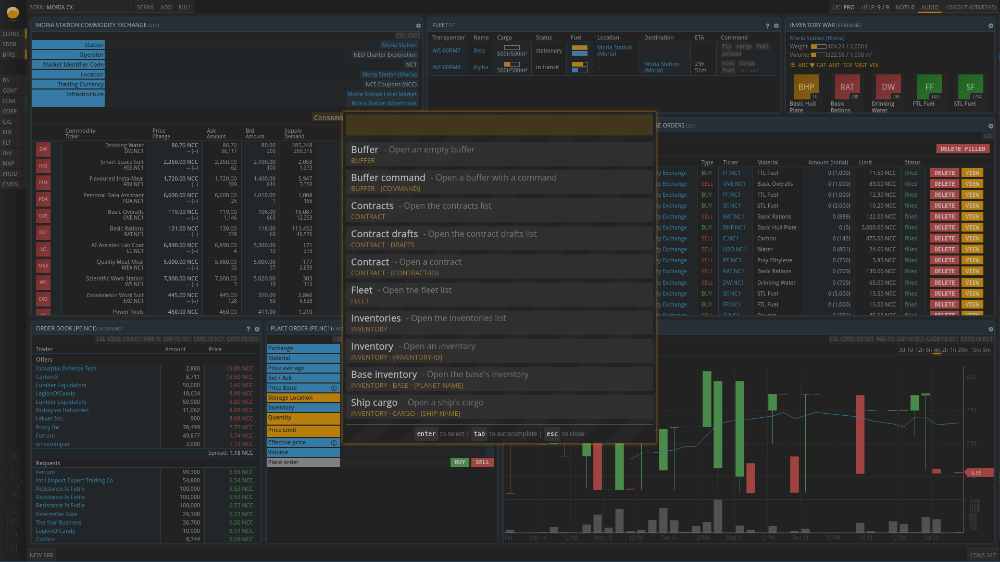

# PrUn Palette

PrUn Palette is a browser extension designed to enhance the gameplay experience
of Prosperous Universe. It offers a versatile and customizable command palette,
which allows players to manage their game actions via a few keystrokes.

## Table of Contents

 - [Installation](#installation)
 - [Development](#development)
 - [Building](#building)
 - [Contributing](#contributing)
 - [License](#license)

## Installation

To install PrUn Palette for personal use, you can download it from the
[Chrome](https://chrome.google.com/webstore/detail/prun-palette/lfnnlbomdeeijpmgigmkkdemhpjelikg)
or [Firefox](https://addons.mozilla.org/en-US/firefox/addon/prun-palette/)
extension stores. You may also want to checkout the
[website](https://otard95.github.io/prun-palette-site/).

## Development

This project uses `pnpm`.
To run PrUn Palette in a development environment, follow these steps:

 - Clone the repository, your fork or download the source code.
 - Navigate into the project directory: `cd prun-palette`
 - Install the dependencies: `pnpm install`
 - Build and watch for changes: `pnpm watch` - Or just build: `pnpm build`
 - Add `./build-<browser>` as an extension, this varies based on the browser.

 > See [Contribution Guide](./CONTRIBUTION_GUIDE.md) for more details.

## Building

To build the extension for production, run the following command in the project
directory: `pnpm build:prod`

This will create a build directory with the compiled extension.

## Contributing

PrUn Palette thrives on the valuable contributions from our community. Whether it's a bug report, feature suggestion, or a code contribution, they all help make PrUn Palette better.

For detailed guidelines on how to contribute, please refer to our [Contribution Guide](./CONTRIBUTION_GUIDE.md). We can't wait to see your ideas and work!

## License

PrUn Palette is licensed under the GPL 3.0 license.
